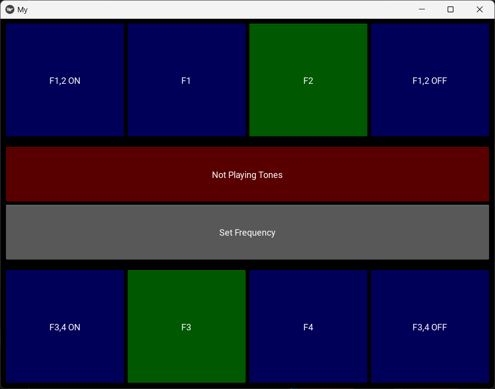
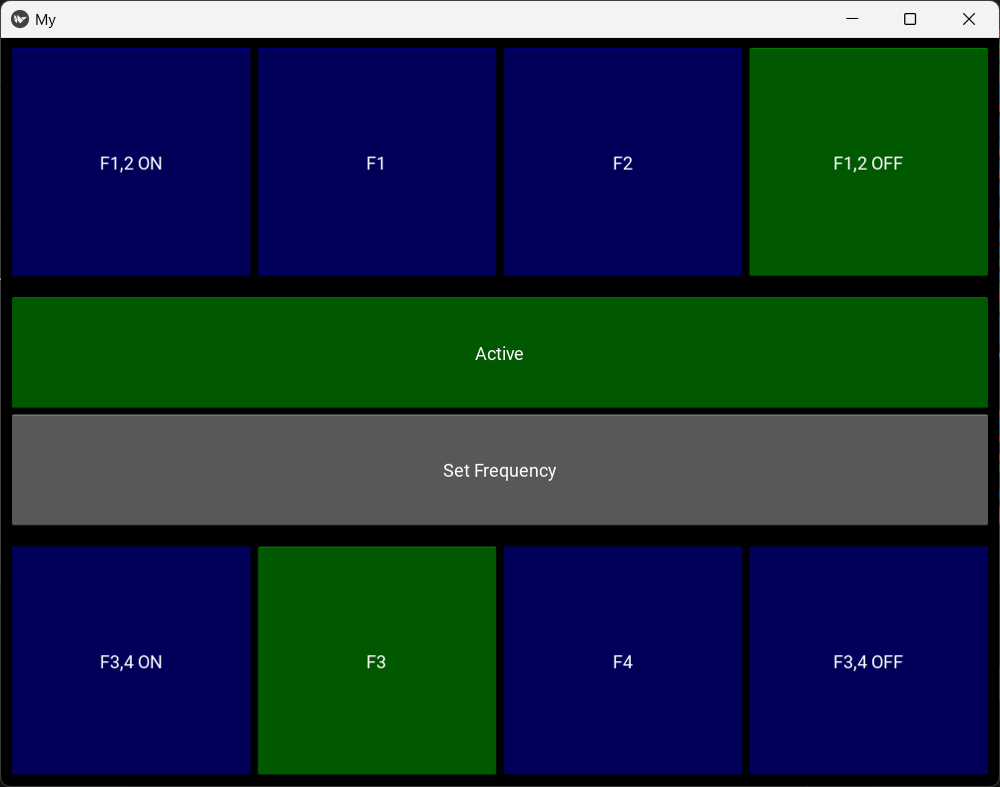

# Multi-Tone-Generator App

The Multi-Tone Generator App is a Python application created with Kivy and Pygame. It enables users to generate and manipulate up to four tones simultaneously, each with its unique frequency, all in real-time. The app was originally designed for controlling an audio-responsive RC car, where the four frequencies generated would dictate the speed of the car's two wheels.

## Features

- **Multi-Frequency Generation:** Generate up to four tones, each with a customizable frequency.
- **User Interface:** A simple and intuitive interface with buttons to toggle tones on/off and set frequencies.
- **Real-time Playback:** Listen to the generated tones in real-time.
- **Frequency Customization:** Set custom frequencies for each tone using the frequency setting popup.

## Installation

1. Ensure you have Python installed on your system.

2. Clone the repository

3. Install the required dependencies:

4. Run the main.py file to launch the application:

## Usage

1. Launch the application.
2. Use the 'Set Freq' button to open the frequency setting popup.
3. Adjust the frequency values for each tone as desired and click 'Save', otherwise default values will be used.
4. Toggle individual tones on/off using the respective buttons.
5. The Activate button indicates whether sound is playing or not.

## Screenshots

| No sound played | Set Frequencies |
|-------------------------------|-------------------------------|
|  |  |

| Only play Frequency 3 | Only play Frequencies 1, 2 and 4 |
|--------------------------------------|---------------------------------------------|
|  |  |

| Play all frequencies |
|------------------------------------|
|  |

